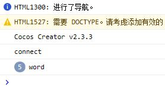
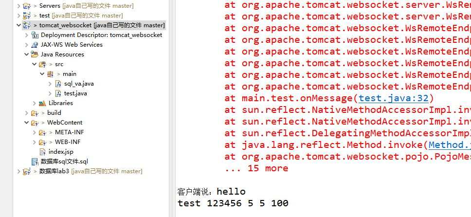

在没有配置好环境之前本工程运行是不会有任何效果的！

环境：

cocos creator v2.3.3

mysql 8.0.19

eclipse

tomcat v8.0+eclipse的tomcat插件


运行时需要先运行tomcat_websocket下的sql文件

然后需要重新配置服务器端的mysql的USER,PASSWORD和URL

```js
var webSocket = 
            new WebSocket('ws://localhost:8080/tomcat_websocket/test');
```

websocket的连接地址如果你改了项目名就要跟着修改

test是一个java的servlet源文件，在src/main目录下


客户端运行截图，浏览器下F12



服务器端运行截图,eclipse:

